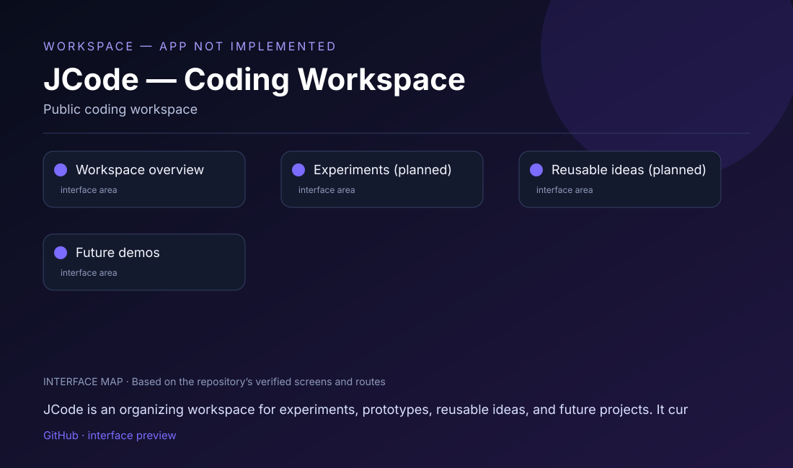

# JCode — Coding Workspace

## What this project is

JCode is an organizing workspace for experiments, prototypes, reusable ideas, and future projects. It currently has no runnable application entry point.

## Interface at a glance

This repository contains or plans the following visitor-facing areas:

- **Workspace overview**
- **Experiments (planned)**
- **Reusable ideas (planned)**
- **Future demos**

The visual map above is based on the actual repository structure. It is deliberately labeled as an **interface map**, not a fabricated product screenshot.

## Run / view

There is currently no run command because the repository has no source code, package manifest, or deployed app.

**Repository link:** [https://github.com/mahatirmahmud688601-wq/jcode](https://github.com/mahatirmahmud688601-wq/jcode)

## Project status

> WORKSPACE — APP NOT IMPLEMENTED

The preview is a status/interface roadmap, not a fabricated application screenshot.

## Repository notes

- Keep API keys, OAuth secrets, signing keys, and private environment files out of Git.
- Add a verified public demo, APK, or release link here when one is available.
- Add real screenshots from the running app after the required local dependencies and credentials are configured.

## Technology

Public coding workspace

---

Maintained by [mahatirmahmud688601-wq](https://github.com/mahatirmahmud688601-wq).
